<div align="center">
  
</div>

<br />

<div align="center">
  <a href="https://github.com/LenChoi?tab=followers">
    
  </a>
  <a href="https://clilc.github.io">
    
  </a>
  
</div>

## Hello, I'm Minho 👋

I'm a **Backend & Blockchain Developer** based in Seoul, building systems that remain predictable under real-world load.
I care about clear domain boundaries, observable production behavior, and code that is easy to change without fear.

```kotlin
data class Engineer(
    val name: String = "Choi Minho",
    val role: String = "Backend & Blockchain Developer",
    val location: String = "Seoul, South Korea",
    val focus: List<String> = listOf(
        "Scalable backend architecture",
        "Event-driven & reactive systems",
        "Blockchain infrastructure"
    )
)
```

### What I'm focused on

- Designing resilient services with **Kotlin, Java, Spring Boot, and Coroutines**
- Building event-driven systems with **Kafka, WebSocket, and reactive streams**
- Exploring blockchain protocols, smart contracts, wallets, and on-chain infrastructure
- Turning production lessons into reusable engineering knowledge

## Tech radar

<div align="center">

| Backend | Data & Messaging | Blockchain | Infrastructure |
|:---:|:---:|:---:|:---:|
|  |  |  |  |

</div>

## Selected work

<table>
  <tr>
    <td width="50%">
      <h3 align="center"><a href="https://github.com/LenChoi/spring-scalable-system-design">spring-scalable-system-design</a></h3>
      <p align="center">Scalable system design and performance experiments with Spring and Kotlin.</p>
      <p align="center"><code>Kotlin</code> <code>Spring</code> <code>System Design</code></p>
    </td>
    <td width="50%">
      <h3 align="center"><a href="https://github.com/LenChoi/blockchain-rust">blockchain-rust</a></h3>
      <p align="center">Exploring blockchain internals and systems programming through Rust.</p>
      <p align="center"><code>Rust</code> <code>Blockchain</code> <code>Protocol</code></p>
    </td>
  </tr>
  <tr>
    <td width="50%">
      <h3 align="center"><a href="https://github.com/LenChoi/reactor-webflux-kotlin">reactor-webflux-kotlin</a></h3>
      <p align="center">Reactive server patterns with Kotlin, Project Reactor, and WebFlux.</p>
      <p align="center"><code>Kotlin</code> <code>WebFlux</code> <code>Reactive</code></p>
    </td>
    <td width="50%">
      <h3 align="center"><a href="https://github.com/LenChoi/TIL">TIL</a></h3>
      <p align="center">An evolving knowledge base of engineering notes and practical lessons.</p>
      <p align="center"><code>Learning</code> <code>Architecture</code> <code>Notes</code></p>
    </td>
  </tr>
</table>

## GitHub at a glance

<div align="center">
  
  
  
</div>

<div align="center">
  
</div>

<picture>
  <source media="(prefers-color-scheme: dark)" srcset="https://raw.githubusercontent.com/LenChoi/LenChoi/output/github-contribution-grid-snake-dark.svg" />
  <source media="(prefers-color-scheme: light)" srcset="https://raw.githubusercontent.com/LenChoi/LenChoi/output/github-contribution-grid-snake.svg" />
  
</picture>

<div align="center">
  <sub>Build deliberately. Observe everything. Improve continuously.</sub>
</div>
