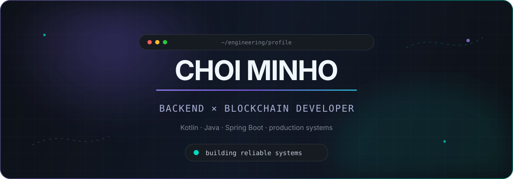

    
  

   
  
  ## Hello, I'm Minho 👋

  I'm a **Backend Developer** based in Seoul.
  I build and operate server applications with **Kotlin, Java, and Spring Boot** — with a focus on systems that move money: payments, points, and settlement, where
  consistency is non-negotiable.

  

    
  

  ## Featured work
  
  **[더화환 (The Hwahwan)](https://더화환.com)** — a flower-wreath commerce platform I designed, built, and operate end-to-end, solo. Payment integration with
  automated reconciliation, 30+ domains on a hexagonal multi-module backend, zero-downtime rolling deploys, and a self-hosted monitoring stack.
  → [Technical case study (Notion)](https://pumped-banon-cee.notion.site/39f0549adc8780129ee2e9cb53dddbd9)

  ## Engineering focus

  - Backend architecture and domain modeling — hexagonal boundaries enforced at the module level
  - Data consistency, concurrency control, and transaction boundaries
  - Payment, point, and settlement pipelines with reconciliation as a safety net
  - Operational automation, monitoring, and observability

  ## AI-assisted engineering

  I use **Claude Code** as a primary development tool to move faster without lowering the engineering bar.

  - Explore unfamiliar codebases and trace behavior across modules
  - Turn requirements into small, reviewable implementation steps
  - Accelerate testing, refactoring, and technical documentation
  - Validate AI-assisted changes through diffs, automated checks, and runtime evidence

  AI supports the execution; architecture, trade-offs, and final responsibility remain human-owned.

  

    
    
     
    Live token usage across Claude Code, Codex CLI, and Gemini CLI, sealed by <a href="https://github.com/LenChoi/tokseal">tokseal</a>. Self-reported, aggregate counts only.
  

  ## GitHub stats

  

    <picture>
      <source media="(prefers-color-scheme: dark)" srcset="https://github-readme-stats.vercel.app/api?username=LenChoi&show_icons=true&count_private=true&line_height=24&hide=stars&hide_border=true&theme=github_dark" />
      
    </picture>
    <picture>
      <source media="(prefers-color-scheme: dark)" srcset="https://github-readme-stats.vercel.app/api/top-langs/?username=LenChoi&layout=compact&hide_border=true&theme=github_dark" />
      
    </picture>
  

  ## This year's contributions

  <picture>
    <source media="(prefers-color-scheme: dark)" srcset="https://raw.githubusercontent.com/LenChoi/LenChoi/output/github-contribution-grid-snake-dark.svg" />
    <source media="(prefers-color-scheme: light)" srcset="https://raw.githubusercontent.com/LenChoi/LenChoi/output/github-contribution-grid-snake.svg" />
    
  </picture>

  

    Simple boundaries. Observable systems. Deliberate changes.
  

